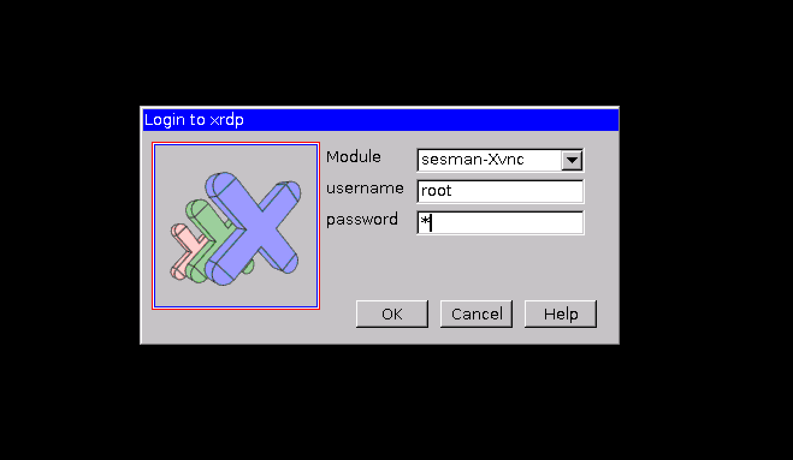
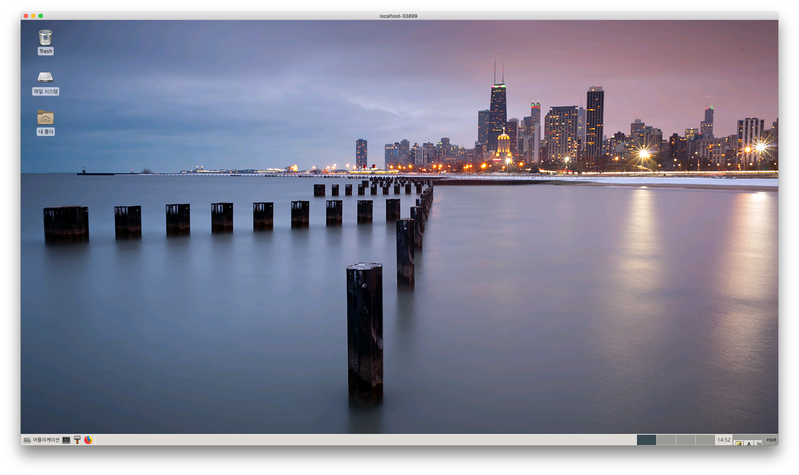
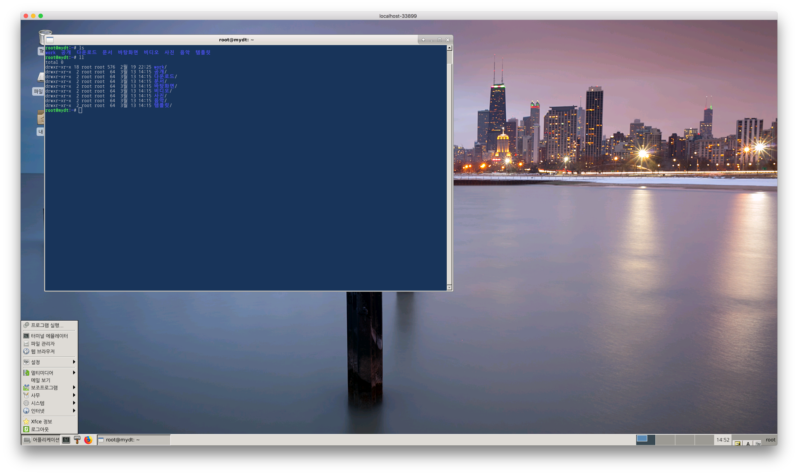
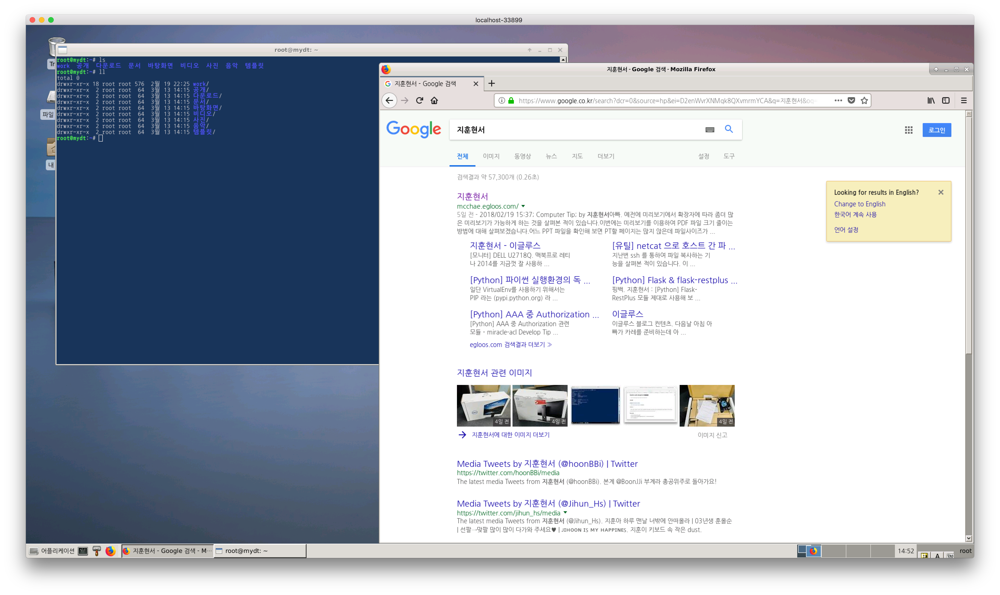

#  목적

오래 전 [우분투 서버를 이용한 커스텀 ISO 만들기](https://github.com/mcchae/vbuntu-custom-ubuntu-iso)를 작업하여 가상머신 용 우분투 개발 환경을 만들었었습니다.

그 이후 Docker 컨테이너 용으로 만들어 본 적이 있습니다. 그 당시 주로 컨테이너의 production OS로 alpine linux를 이용했으므로 알파인 리눅스에 웹 브라우저 또는 원격 데스크탑으로 접속 할 수 있게 하였습니다. 작업 내용을 여기에 다시 기술해 보면,

## [docker-xfce](https://github.com/mcchae/docker-xfce) 작업 내용

* Asia/Seoul 타임존 설정
* 한글 입력 환경 (터미널, FireFox 등)
* [xfce 환경](http://mcchae.egloos.com/10935938)
* built-in [tmux 환경](http://mcchae.egloos.com/11246020) (tmux를 이용하면 ssh 등을 연결한 터미널 환경에서 자신이 작업했던 터미널 환경을 그대로 재사용하거나 다른 사람과 화면을 공유하면서 확인해 볼 수 있는 장점이 생기더군요)
* 배경화면이 1시간 마다 자동 변경됨
* 키 자동 반복이 안되는 것을 해결하였습니다.
* 로그아웃 기능이 안되는 것을 수정해 놓았습니다.
* Xface의 디폴트 패널을 LXDE의 것과 최대한 유사하게 만들어 놓았습니다. (하단 1개의 패널)
* 터미널의 배경 색이 새로 뜰 때마다 변경됩니다. (Xfce-Terminal의 디폴트 속성입니다)
* Firefox 웹브라우저를 설치했습니다. 
* 파이썬 자동 환경 설정을 위한 autoenv를 `/root/.autoenv`에 설치했습니다.

와 같았습니다.

그런데 이번에 또 다시 필요에 따라 우분투 서버 위에 간단한 UI 환경의 컨테이너가 필요하게 되었습니다. 그 이유는 alpine 이 아니라 Ubuntu 위에서 컴파일 되고 돌아갈 수 있는 프로그램이 있는데 이것을 Ubuntu Server 로 docker image를 만들어 컨테이너로 사용하였기 때문이었습니다. 그런 경우에도 디버깅이 필요한데 그 경우에도 다른 컨테이너가 동작하고 있고 연결되어 디버깅 등이 필요한데 그 때 이런 UI 환경이 동작하는 컨테이너가 필요합니다.

> [참고: Ubuntu 16.04 가벼운 LXDE 환경](http://mcchae.egloos.com/11214796)

따라서 이번에 NOVNC를 통한 웹브라우저를 제외하고 다른 작업을 하고 성공을 하여 올려봅니다.

## [docker-xfce](https://github.com/mcchae/docker-xfce) 작업 내용

* Asia/Seoul 타임존 설정
* 한글 입력 환경 (터미널, FireFox 등)
* [xfce 환경](http://mcchae.egloos.com/10935938)
* built-in [tmux 환경](http://mcchae.egloos.com/11246020) (tmux를 이용하면 ssh 등을 연결한 터미널 환경에서 자신이 작업했던 터미널 환경을 그대로 재사용하거나 다른 사람과 화면을 공유하면서 확인해 볼 수 있는 장점이 생기더군요)
* 배경화면이 1시간 마다 자동 변경됨
* 키 자동 반복이 안되는 것을 해결하였습니다.
* 로그아웃 기능이 안되는 것을 수정해 놓았습니다.
* Xface의 디폴트 패널을 LXDE의 것과 최대한 유사하게 만들어 놓았습니다. (하단 1개의 패널)
* Firefox 웹브라우저를 설치했습니다. 

그리고 외부에 노출되는 포트 및, 이용할 수 있는 서비스 입니다.

* `rdp`[3393] : 원래 윈도우에서는 원격데스크탑, Linux에서는 VNC 로 화면 공유를 하고는 했었지요. 그런데 VNC 대비 RDP가 압축 및 속도 등에서 좀 더 우위를 보였었습니다. 그리고 윈도우에 기본으로 원격 데스크탑 클라이언트 프로그램이 설치되어 있다는 것도 장점이 될 수 있지요. 그래서 xrdp 라는 것을 리눅스에 설치하면 VNC 환경 위에 RDP 환경을 이용할 수 있게 Wrapping 시키는 역할을 합니다.


## 사용법

### docker 이용

```bash
# 내 데스크탑 이름
MYDT=rdp
# docker host에서 사용할 RDP 포트
HP_RDP=33899
docker container run -it \
	--name $MYDT \
	--hostname $MYDT \
	-p $HP_RDP:3389 \
	-v /dhv/vbuntu/root:/root \
	mcchae/vbuntu
```

> `-it` 대신 `-d` 옵션을 이용하면 백그라운드 서비스로 실행됩니다.

### docker compose 이용

`~/mydt.yml` 이라는 이름으로 다음의 내용을 저장합니다.

``` yaml
version: '2'
services:
  mydt:
    image: "mcchae/vbuntu"
    hostname: "mydt"
    ports:
     - "33899:3389"
    volumes:
     - ${HOME}/dhv/root:/root
     # 아래의 볼륨은 작업을 위하여 별도 지정하는 경우
     - ${HOME}/work:/root/work
```

> * `3389` 포트는 외부로 노출될 원격데스크탑 포트입니다. (위의 예에서는 33899 포트로 접근 가능합니다)
> * docker를 돌리는 호스트에 `$HOME/dhv`라는 폴더가 있고 이 폴더에 있는 `root` 디렉터리가 docker 컨테이너의 `/root` 디렉터리로 볼륨 마운트되어 root 홈 폴더는 영속성을 갖습니다
> * `$HOME/work` 라는 폴더에 모든 프로젝트가 있고 작업을 하는데 이것이 컨테이너의 `/root/work`로 볼륨 마운트되어 프로젝트 작업을 합니다


그 다음, 다음과 같이 실행합니다.

```sh
$ docker-compose -f ~/mydt.yml up
```

> * `-d` 옵션을 이용하면 백그라운드 서비스로 실행됩니다.
> * `docker-compose -f ~/mydt.yml logs` 명령으로 컨테이너의 로그를 확인합니다. (특별히 -d 로 up 하였을 경우)
> * `docker-compose -f ~/mydt.yml down` 명령으로 컨테이너를 내립니다.


## 실행 예

다음은 실행한 화면입니다.

### 원격 데스크탑으로 연결


원격 데스크탑으로 연결합니다. `root`사용자에 암호는 `r`입니다. 

> 원격 접속할 때는 호스트 포트를 잘 확인해 보시기 바랍니다. 예: `33899:3389` 인 경우 33899로 docker host에 연동되므로 33899 포트로 접속합니다.
> 보안이 중요한 환경에서는 별도 이미지로 꼭 암호를 설정해 주시기 바랍니다.


처음에 뜨는 화면입니다. 해상도는 원격 데스크탑에서 지정한 해상도 입니다.


터미널을 띄워 봅니다. `shift+space` 키로 한영 전환이 가능합니다.
`tmb` 라고 tmux alias 명령을 내려보면 네 창으로 구분된 tmux 환경이 뜹니다.
[참고: tmux 이용](http://mcchae.egloos.com/11246020)


firefox를 기본 웹 브라우저로 이용합니다. 한영전환은 역시 `shift+space` 키 입니다.

# 결론

위와 같이 컨테이버 기반의 가벼운 데스크탑을 Docker로 구현해 보았습니다. 그 쓰임새 및 이용은 기대 이상일 것으로 상상됩니다.

어느 분께는 도움이 되셨기를...

